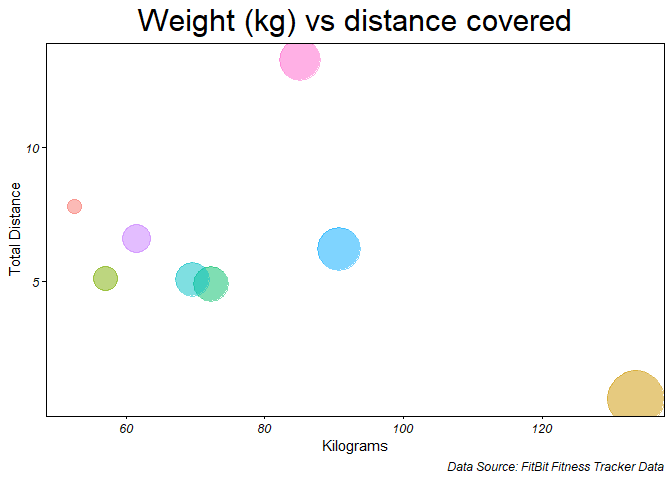

## ASK

### About Bellabeat

Bellabeat is a high-tech manufacturer of health-focused products for.Their mission is to become a major player in the  smart device production.
They desire to find new opportunities to grow its business. For that reason, we are going to analyze information about its current users utilizing the products offered by the company (smart devices). The mission is to find trends in the data and make useful recommendations for the company.

### Key Stakeholders

* Urška Sršen: Bellabeat’s co-founder and Chief Creative Officer.
* Sando Mur: Mathematician and Bellabeat’s co-founder.

### Business task

I will try to answer these questions:

 * What are some trends in smart device usage?
 * How could these trends apply to Bellabeat customers?
 * How could these trends help influence Bellabeat marketing strategy

## PREPARE
This data set contains personal fitness tracker from thirty fitbit users.  It includes information about daily activity, steps, and heart rate that can be used to explore habits and patterns.


### limitation

Data was collected in the year 2016. Users' daily activities, fitness and sleeping habits, diet and food consumption may have changed since then, hence data may not be timely or relevant. Sample size of 33 female FitBit users is not representative of the entire female population and moreover weight data is only from 8 users. As data is collected in a survey, hence unable to ascertain the integrity or accuracy of data.


## PROCESS

### importing required libraries

```r
library(tidyverse)
```

```
## -- Attaching packages --------------------------------------- tidyverse 1.3.0 --
```

```
## v ggplot2 3.3.5     v purrr   0.3.4
## v tibble  3.1.3     v dplyr   1.0.7
## v tidyr   1.1.3     v stringr 1.4.0
## v readr   1.4.0     v forcats 0.5.0
```

```
## -- Conflicts ------------------------------------------ tidyverse_conflicts() --
## x dplyr::filter() masks stats::filter()
## x dplyr::lag()    masks stats::lag()
```

```r
library(kableExtra)   # For viewing tables in an awesome way!
```

```
## 
## Attaching package: 'kableExtra'
```

```
## The following object is masked from 'package:dplyr':
## 
##     group_rows
```

```r
library(scales)   # For transforming numbers in percentage
```

```
## 
## Attaching package: 'scales'
```

```
## The following object is masked from 'package:purrr':
## 
##     discard
```

```
## The following object is masked from 'package:readr':
## 
##     col_factor
```

```r
library(highcharter) # Cool and interactive graphs
```

```
## Registered S3 method overwritten by 'quantmod':
##   method            from
##   as.zoo.data.frame zoo
```

```r
library(RColorBrewer)  # Pallete colors
```


### importing data to our working directory


```r
daily_activity<-read.csv("dailyActivity_merged.csv")
daily_calories<-read.csv("dailyCalories_merged.csv")
daily_intensities<-read.csv("dailyIntensities_merged.csv")
daily_steps<-read.csv("dailySteps_merged.csv")
daily_sleep<-read.csv("sleepDay_merged.csv")
weight_log<-read.csv("weightLogInfo_merged.csv")
```

### viewing datasets


```r
kbl(daily_activity[1:5, ], 'html', caption = 'Table 1: Daily activity') %>% 
  kable_styling(bootstrap_options = c("striped", "hover", "condensed")) %>% 
  scroll_box(width = "100%")
```

<div style="border: 1px solid #ddd; padding: 5px; overflow-x: scroll; width:100%; "><table class="table table-striped table-hover table-condensed" style="margin-left: auto; margin-right: auto;">
<caption>Table 1: Daily activity</caption>
 <thead>
  <tr>
   <th style="text-align:right;"> Id </th>
   <th style="text-align:left;"> ActivityDate </th>
   <th style="text-align:right;"> TotalSteps </th>
   <th style="text-align:right;"> TotalDistance </th>
   <th style="text-align:right;"> TrackerDistance </th>
   <th style="text-align:right;"> LoggedActivitiesDistance </th>
   <th style="text-align:right;"> VeryActiveDistance </th>
   <th style="text-align:right;"> ModeratelyActiveDistance </th>
   <th style="text-align:right;"> LightActiveDistance </th>
   <th style="text-align:right;"> SedentaryActiveDistance </th>
   <th style="text-align:right;"> VeryActiveMinutes </th>
   <th style="text-align:right;"> FairlyActiveMinutes </th>
   <th style="text-align:right;"> LightlyActiveMinutes </th>
   <th style="text-align:right;"> SedentaryMinutes </th>
   <th style="text-align:right;"> Calories </th>
  </tr>
 </thead>
<tbody>
  <tr>
   <td style="text-align:right;"> 1503960366 </td>
   <td style="text-align:left;"> 4/12/2016 </td>
   <td style="text-align:right;"> 13162 </td>
   <td style="text-align:right;"> 8.50 </td>
   <td style="text-align:right;"> 8.50 </td>
   <td style="text-align:right;"> 0 </td>
   <td style="text-align:right;"> 1.88 </td>
   <td style="text-align:right;"> 0.55 </td>
   <td style="text-align:right;"> 6.06 </td>
   <td style="text-align:right;"> 0 </td>
   <td style="text-align:right;"> 25 </td>
   <td style="text-align:right;"> 13 </td>
   <td style="text-align:right;"> 328 </td>
   <td style="text-align:right;"> 728 </td>
   <td style="text-align:right;"> 1985 </td>
  </tr>
  <tr>
   <td style="text-align:right;"> 1503960366 </td>
   <td style="text-align:left;"> 4/13/2016 </td>
   <td style="text-align:right;"> 10735 </td>
   <td style="text-align:right;"> 6.97 </td>
   <td style="text-align:right;"> 6.97 </td>
   <td style="text-align:right;"> 0 </td>
   <td style="text-align:right;"> 1.57 </td>
   <td style="text-align:right;"> 0.69 </td>
   <td style="text-align:right;"> 4.71 </td>
   <td style="text-align:right;"> 0 </td>
   <td style="text-align:right;"> 21 </td>
   <td style="text-align:right;"> 19 </td>
   <td style="text-align:right;"> 217 </td>
   <td style="text-align:right;"> 776 </td>
   <td style="text-align:right;"> 1797 </td>
  </tr>
  <tr>
   <td style="text-align:right;"> 1503960366 </td>
   <td style="text-align:left;"> 4/14/2016 </td>
   <td style="text-align:right;"> 10460 </td>
   <td style="text-align:right;"> 6.74 </td>
   <td style="text-align:right;"> 6.74 </td>
   <td style="text-align:right;"> 0 </td>
   <td style="text-align:right;"> 2.44 </td>
   <td style="text-align:right;"> 0.40 </td>
   <td style="text-align:right;"> 3.91 </td>
   <td style="text-align:right;"> 0 </td>
   <td style="text-align:right;"> 30 </td>
   <td style="text-align:right;"> 11 </td>
   <td style="text-align:right;"> 181 </td>
   <td style="text-align:right;"> 1218 </td>
   <td style="text-align:right;"> 1776 </td>
  </tr>
  <tr>
   <td style="text-align:right;"> 1503960366 </td>
   <td style="text-align:left;"> 4/15/2016 </td>
   <td style="text-align:right;"> 9762 </td>
   <td style="text-align:right;"> 6.28 </td>
   <td style="text-align:right;"> 6.28 </td>
   <td style="text-align:right;"> 0 </td>
   <td style="text-align:right;"> 2.14 </td>
   <td style="text-align:right;"> 1.26 </td>
   <td style="text-align:right;"> 2.83 </td>
   <td style="text-align:right;"> 0 </td>
   <td style="text-align:right;"> 29 </td>
   <td style="text-align:right;"> 34 </td>
   <td style="text-align:right;"> 209 </td>
   <td style="text-align:right;"> 726 </td>
   <td style="text-align:right;"> 1745 </td>
  </tr>
  <tr>
   <td style="text-align:right;"> 1503960366 </td>
   <td style="text-align:left;"> 4/16/2016 </td>
   <td style="text-align:right;"> 12669 </td>
   <td style="text-align:right;"> 8.16 </td>
   <td style="text-align:right;"> 8.16 </td>
   <td style="text-align:right;"> 0 </td>
   <td style="text-align:right;"> 2.71 </td>
   <td style="text-align:right;"> 0.41 </td>
   <td style="text-align:right;"> 5.04 </td>
   <td style="text-align:right;"> 0 </td>
   <td style="text-align:right;"> 36 </td>
   <td style="text-align:right;"> 10 </td>
   <td style="text-align:right;"> 221 </td>
   <td style="text-align:right;"> 773 </td>
   <td style="text-align:right;"> 1863 </td>
  </tr>
</tbody>
</table></div>


```r
kbl(daily_calories[1:7, ], 'html', caption = 'Table 2: Daily calories') %>% 
kable_styling(bootstrap_options = c("striped", "hover"), 
              full_width = F)
```

<table class="table table-striped table-hover" style="width: auto !important; margin-left: auto; margin-right: auto;">
<caption>Table 2: Daily calories</caption>
 <thead>
  <tr>
   <th style="text-align:right;"> Id </th>
   <th style="text-align:left;"> ActivityDay </th>
   <th style="text-align:right;"> Calories </th>
  </tr>
 </thead>
<tbody>
  <tr>
   <td style="text-align:right;"> 1503960366 </td>
   <td style="text-align:left;"> 4/12/2016 </td>
   <td style="text-align:right;"> 1985 </td>
  </tr>
  <tr>
   <td style="text-align:right;"> 1503960366 </td>
   <td style="text-align:left;"> 4/13/2016 </td>
   <td style="text-align:right;"> 1797 </td>
  </tr>
  <tr>
   <td style="text-align:right;"> 1503960366 </td>
   <td style="text-align:left;"> 4/14/2016 </td>
   <td style="text-align:right;"> 1776 </td>
  </tr>
  <tr>
   <td style="text-align:right;"> 1503960366 </td>
   <td style="text-align:left;"> 4/15/2016 </td>
   <td style="text-align:right;"> 1745 </td>
  </tr>
  <tr>
   <td style="text-align:right;"> 1503960366 </td>
   <td style="text-align:left;"> 4/16/2016 </td>
   <td style="text-align:right;"> 1863 </td>
  </tr>
  <tr>
   <td style="text-align:right;"> 1503960366 </td>
   <td style="text-align:left;"> 4/17/2016 </td>
   <td style="text-align:right;"> 1728 </td>
  </tr>
  <tr>
   <td style="text-align:right;"> 1503960366 </td>
   <td style="text-align:left;"> 4/18/2016 </td>
   <td style="text-align:right;"> 1921 </td>
  </tr>
</tbody>
</table>


```r
kbl(daily_steps[1:5, ], 'html', caption = 'Table 3: Daily steps') %>% 
kable_styling(bootstrap_options = c("striped", "hover"), 
              full_width = F)
```

<table class="table table-striped table-hover" style="width: auto !important; margin-left: auto; margin-right: auto;">
<caption>Table 3: Daily steps</caption>
 <thead>
  <tr>
   <th style="text-align:right;"> Id </th>
   <th style="text-align:left;"> ActivityDay </th>
   <th style="text-align:right;"> StepTotal </th>
  </tr>
 </thead>
<tbody>
  <tr>
   <td style="text-align:right;"> 1503960366 </td>
   <td style="text-align:left;"> 4/12/2016 </td>
   <td style="text-align:right;"> 13162 </td>
  </tr>
  <tr>
   <td style="text-align:right;"> 1503960366 </td>
   <td style="text-align:left;"> 4/13/2016 </td>
   <td style="text-align:right;"> 10735 </td>
  </tr>
  <tr>
   <td style="text-align:right;"> 1503960366 </td>
   <td style="text-align:left;"> 4/14/2016 </td>
   <td style="text-align:right;"> 10460 </td>
  </tr>
  <tr>
   <td style="text-align:right;"> 1503960366 </td>
   <td style="text-align:left;"> 4/15/2016 </td>
   <td style="text-align:right;"> 9762 </td>
  </tr>
  <tr>
   <td style="text-align:right;"> 1503960366 </td>
   <td style="text-align:left;"> 4/16/2016 </td>
   <td style="text-align:right;"> 12669 </td>
  </tr>
</tbody>
</table>


```r
kbl(daily_intensities[1:5, ], 'html', caption = 'Table 4: Daily intensities') %>%  
  kable_styling(bootstrap_options = c("striped", "hover")) %>% 
  scroll_box(width = "100%")  # Adding a scroll bar
```

<div style="border: 1px solid #ddd; padding: 5px; overflow-x: scroll; width:100%; "><table class="table table-striped table-hover" style="margin-left: auto; margin-right: auto;">
<caption>Table 4: Daily intensities</caption>
 <thead>
  <tr>
   <th style="text-align:right;"> Id </th>
   <th style="text-align:left;"> ActivityDay </th>
   <th style="text-align:right;"> SedentaryMinutes </th>
   <th style="text-align:right;"> LightlyActiveMinutes </th>
   <th style="text-align:right;"> FairlyActiveMinutes </th>
   <th style="text-align:right;"> VeryActiveMinutes </th>
   <th style="text-align:right;"> SedentaryActiveDistance </th>
   <th style="text-align:right;"> LightActiveDistance </th>
   <th style="text-align:right;"> ModeratelyActiveDistance </th>
   <th style="text-align:right;"> VeryActiveDistance </th>
  </tr>
 </thead>
<tbody>
  <tr>
   <td style="text-align:right;"> 1503960366 </td>
   <td style="text-align:left;"> 4/12/2016 </td>
   <td style="text-align:right;"> 728 </td>
   <td style="text-align:right;"> 328 </td>
   <td style="text-align:right;"> 13 </td>
   <td style="text-align:right;"> 25 </td>
   <td style="text-align:right;"> 0 </td>
   <td style="text-align:right;"> 6.06 </td>
   <td style="text-align:right;"> 0.55 </td>
   <td style="text-align:right;"> 1.88 </td>
  </tr>
  <tr>
   <td style="text-align:right;"> 1503960366 </td>
   <td style="text-align:left;"> 4/13/2016 </td>
   <td style="text-align:right;"> 776 </td>
   <td style="text-align:right;"> 217 </td>
   <td style="text-align:right;"> 19 </td>
   <td style="text-align:right;"> 21 </td>
   <td style="text-align:right;"> 0 </td>
   <td style="text-align:right;"> 4.71 </td>
   <td style="text-align:right;"> 0.69 </td>
   <td style="text-align:right;"> 1.57 </td>
  </tr>
  <tr>
   <td style="text-align:right;"> 1503960366 </td>
   <td style="text-align:left;"> 4/14/2016 </td>
   <td style="text-align:right;"> 1218 </td>
   <td style="text-align:right;"> 181 </td>
   <td style="text-align:right;"> 11 </td>
   <td style="text-align:right;"> 30 </td>
   <td style="text-align:right;"> 0 </td>
   <td style="text-align:right;"> 3.91 </td>
   <td style="text-align:right;"> 0.40 </td>
   <td style="text-align:right;"> 2.44 </td>
  </tr>
  <tr>
   <td style="text-align:right;"> 1503960366 </td>
   <td style="text-align:left;"> 4/15/2016 </td>
   <td style="text-align:right;"> 726 </td>
   <td style="text-align:right;"> 209 </td>
   <td style="text-align:right;"> 34 </td>
   <td style="text-align:right;"> 29 </td>
   <td style="text-align:right;"> 0 </td>
   <td style="text-align:right;"> 2.83 </td>
   <td style="text-align:right;"> 1.26 </td>
   <td style="text-align:right;"> 2.14 </td>
  </tr>
  <tr>
   <td style="text-align:right;"> 1503960366 </td>
   <td style="text-align:left;"> 4/16/2016 </td>
   <td style="text-align:right;"> 773 </td>
   <td style="text-align:right;"> 221 </td>
   <td style="text-align:right;"> 10 </td>
   <td style="text-align:right;"> 36 </td>
   <td style="text-align:right;"> 0 </td>
   <td style="text-align:right;"> 5.04 </td>
   <td style="text-align:right;"> 0.41 </td>
   <td style="text-align:right;"> 2.71 </td>
  </tr>
</tbody>
</table></div>


```r
kbl(daily_sleep[1:5, ], 'html', caption = 'Table 5: Daily sleep') %>% 
kable_styling(bootstrap_options = c("striped", "hover"), full_width = F)
```

<table class="table table-striped table-hover" style="width: auto !important; margin-left: auto; margin-right: auto;">
<caption>Table 5: Daily sleep</caption>
 <thead>
  <tr>
   <th style="text-align:right;"> Id </th>
   <th style="text-align:left;"> SleepDay </th>
   <th style="text-align:right;"> TotalSleepRecords </th>
   <th style="text-align:right;"> TotalMinutesAsleep </th>
   <th style="text-align:right;"> TotalTimeInBed </th>
  </tr>
 </thead>
<tbody>
  <tr>
   <td style="text-align:right;"> 1503960366 </td>
   <td style="text-align:left;"> 4/12/2016 12:00:00 AM </td>
   <td style="text-align:right;"> 1 </td>
   <td style="text-align:right;"> 327 </td>
   <td style="text-align:right;"> 346 </td>
  </tr>
  <tr>
   <td style="text-align:right;"> 1503960366 </td>
   <td style="text-align:left;"> 4/13/2016 12:00:00 AM </td>
   <td style="text-align:right;"> 2 </td>
   <td style="text-align:right;"> 384 </td>
   <td style="text-align:right;"> 407 </td>
  </tr>
  <tr>
   <td style="text-align:right;"> 1503960366 </td>
   <td style="text-align:left;"> 4/15/2016 12:00:00 AM </td>
   <td style="text-align:right;"> 1 </td>
   <td style="text-align:right;"> 412 </td>
   <td style="text-align:right;"> 442 </td>
  </tr>
  <tr>
   <td style="text-align:right;"> 1503960366 </td>
   <td style="text-align:left;"> 4/16/2016 12:00:00 AM </td>
   <td style="text-align:right;"> 2 </td>
   <td style="text-align:right;"> 340 </td>
   <td style="text-align:right;"> 367 </td>
  </tr>
  <tr>
   <td style="text-align:right;"> 1503960366 </td>
   <td style="text-align:left;"> 4/17/2016 12:00:00 AM </td>
   <td style="text-align:right;"> 1 </td>
   <td style="text-align:right;"> 700 </td>
   <td style="text-align:right;"> 712 </td>
  </tr>
</tbody>
</table>

```r
kbl(weight_log[1:5, ], 'html', caption = 'Table 6: Weight info') %>% 
  kable_styling(bootstrap_options = c("striped", "hover"), full_width = F)
```

<table class="table table-striped table-hover" style="width: auto !important; margin-left: auto; margin-right: auto;">
<caption>Table 6: Weight info</caption>
 <thead>
  <tr>
   <th style="text-align:right;"> Id </th>
   <th style="text-align:left;"> Date </th>
   <th style="text-align:right;"> WeightKg </th>
   <th style="text-align:right;"> WeightPounds </th>
   <th style="text-align:right;"> Fat </th>
   <th style="text-align:right;"> BMI </th>
   <th style="text-align:left;"> IsManualReport </th>
   <th style="text-align:right;"> LogId </th>
  </tr>
 </thead>
<tbody>
  <tr>
   <td style="text-align:right;"> 1503960366 </td>
   <td style="text-align:left;"> 5/2/2016 11:59:59 PM </td>
   <td style="text-align:right;"> 52.6 </td>
   <td style="text-align:right;"> 115.9631 </td>
   <td style="text-align:right;"> 22 </td>
   <td style="text-align:right;"> 22.65 </td>
   <td style="text-align:left;"> True </td>
   <td style="text-align:right;"> 1.462234e+12 </td>
  </tr>
  <tr>
   <td style="text-align:right;"> 1503960366 </td>
   <td style="text-align:left;"> 5/3/2016 11:59:59 PM </td>
   <td style="text-align:right;"> 52.6 </td>
   <td style="text-align:right;"> 115.9631 </td>
   <td style="text-align:right;"> NA </td>
   <td style="text-align:right;"> 22.65 </td>
   <td style="text-align:left;"> True </td>
   <td style="text-align:right;"> 1.462320e+12 </td>
  </tr>
  <tr>
   <td style="text-align:right;"> 1927972279 </td>
   <td style="text-align:left;"> 4/13/2016 1:08:52 AM </td>
   <td style="text-align:right;"> 133.5 </td>
   <td style="text-align:right;"> 294.3171 </td>
   <td style="text-align:right;"> NA </td>
   <td style="text-align:right;"> 47.54 </td>
   <td style="text-align:left;"> False </td>
   <td style="text-align:right;"> 1.460510e+12 </td>
  </tr>
  <tr>
   <td style="text-align:right;"> 2873212765 </td>
   <td style="text-align:left;"> 4/21/2016 11:59:59 PM </td>
   <td style="text-align:right;"> 56.7 </td>
   <td style="text-align:right;"> 125.0021 </td>
   <td style="text-align:right;"> NA </td>
   <td style="text-align:right;"> 21.45 </td>
   <td style="text-align:left;"> True </td>
   <td style="text-align:right;"> 1.461283e+12 </td>
  </tr>
  <tr>
   <td style="text-align:right;"> 2873212765 </td>
   <td style="text-align:left;"> 5/12/2016 11:59:59 PM </td>
   <td style="text-align:right;"> 57.3 </td>
   <td style="text-align:right;"> 126.3249 </td>
   <td style="text-align:right;"> NA </td>
   <td style="text-align:right;"> 21.69 </td>
   <td style="text-align:left;"> True </td>
   <td style="text-align:right;"> 1.463098e+12 </td>
  </tr>
</tbody>
</table>
### removing some datasets

`Daily activity` already contains the information from `Daily calories`,`Daily step` and  `Daily intensities`.


```r
rm(daily_calories, daily_intensities, daily_steps)
```


### cleaning variables before merging
Make them homogeneous and transform it to the right data type.


```r
daily_activity <- daily_activity %>% 
  rename(Date = ActivityDate) %>% 
  mutate(Date = as.Date(Date, format = "%m/%d/%y"))
```


```r
daily_sleep <- daily_sleep %>% 
  rename(Date = SleepDay) %>% 
  mutate(Date = as.Date(Date, format = "%m/%d/%y"))
```


```r
weight_log <- weight_log%>% 
  select(-LogId) %>% 
  mutate(Date = as.Date(Date, format = "%m/%d/%y")) %>% 
  mutate(IsManualReport = as.factor(IsManualReport))
```

### Merging dataframes


```r
final_df <- merge(merge(daily_activity, daily_sleep, by = c('Id', 'Date'), all = TRUE), weight_log, by = c('Id', 'Date'), all = TRUE)
str(final_df)
```

```
## 'data.frame':	943 obs. of  23 variables:
##  $ Id                      : num  1.5e+09 1.5e+09 1.5e+09 1.5e+09 1.5e+09 ...
##  $ Date                    : Date, format: "2020-04-12" "2020-04-13" ...
##  $ TotalSteps              : int  13162 10735 10460 9762 12669 9705 13019 15506 10544 9819 ...
##  $ TotalDistance           : num  8.5 6.97 6.74 6.28 8.16 ...
##  $ TrackerDistance         : num  8.5 6.97 6.74 6.28 8.16 ...
##  $ LoggedActivitiesDistance: num  0 0 0 0 0 0 0 0 0 0 ...
##  $ VeryActiveDistance      : num  1.88 1.57 2.44 2.14 2.71 ...
##  $ ModeratelyActiveDistance: num  0.55 0.69 0.4 1.26 0.41 ...
##  $ LightActiveDistance     : num  6.06 4.71 3.91 2.83 5.04 ...
##  $ SedentaryActiveDistance : num  0 0 0 0 0 0 0 0 0 0 ...
##  $ VeryActiveMinutes       : int  25 21 30 29 36 38 42 50 28 19 ...
##  $ FairlyActiveMinutes     : int  13 19 11 34 10 20 16 31 12 8 ...
##  $ LightlyActiveMinutes    : int  328 217 181 209 221 164 233 264 205 211 ...
##  $ SedentaryMinutes        : int  728 776 1218 726 773 539 1149 775 818 838 ...
##  $ Calories                : int  1985 1797 1776 1745 1863 1728 1921 2035 1786 1775 ...
##  $ TotalSleepRecords       : int  1 2 NA 1 2 1 NA 1 1 1 ...
##  $ TotalMinutesAsleep      : int  327 384 NA 412 340 700 NA 304 360 325 ...
##  $ TotalTimeInBed          : int  346 407 NA 442 367 712 NA 320 377 364 ...
##  $ WeightKg                : num  NA NA NA NA NA NA NA NA NA NA ...
##  $ WeightPounds            : num  NA NA NA NA NA NA NA NA NA NA ...
##  $ Fat                     : int  NA NA NA NA NA NA NA NA NA NA ...
##  $ BMI                     : num  NA NA NA NA NA NA NA NA NA NA ...
##  $ IsManualReport          : Factor w/ 2 levels "False","True": NA NA NA NA NA NA NA NA NA NA ...
```


`TotalDistances` and `TrackerDistances` are identical hence we have to remove one of  them.


```r
final_df <- final_df %>% select(-c(TrackerDistance, LoggedActivitiesDistance, TotalSleepRecords, WeightPounds, Fat, BMI, IsManualReport))

str(final_df)
```

```
## 'data.frame':	943 obs. of  16 variables:
##  $ Id                      : num  1.5e+09 1.5e+09 1.5e+09 1.5e+09 1.5e+09 ...
##  $ Date                    : Date, format: "2020-04-12" "2020-04-13" ...
##  $ TotalSteps              : int  13162 10735 10460 9762 12669 9705 13019 15506 10544 9819 ...
##  $ TotalDistance           : num  8.5 6.97 6.74 6.28 8.16 ...
##  $ VeryActiveDistance      : num  1.88 1.57 2.44 2.14 2.71 ...
##  $ ModeratelyActiveDistance: num  0.55 0.69 0.4 1.26 0.41 ...
##  $ LightActiveDistance     : num  6.06 4.71 3.91 2.83 5.04 ...
##  $ SedentaryActiveDistance : num  0 0 0 0 0 0 0 0 0 0 ...
##  $ VeryActiveMinutes       : int  25 21 30 29 36 38 42 50 28 19 ...
##  $ FairlyActiveMinutes     : int  13 19 11 34 10 20 16 31 12 8 ...
##  $ LightlyActiveMinutes    : int  328 217 181 209 221 164 233 264 205 211 ...
##  $ SedentaryMinutes        : int  728 776 1218 726 773 539 1149 775 818 838 ...
##  $ Calories                : int  1985 1797 1776 1745 1863 1728 1921 2035 1786 1775 ...
##  $ TotalMinutesAsleep      : int  327 384 NA 412 340 700 NA 304 360 325 ...
##  $ TotalTimeInBed          : int  346 407 NA 442 367 712 NA 320 377 364 ...
##  $ WeightKg                : num  NA NA NA NA NA NA NA NA NA NA ...
```


```r
summary(final_df)
```

```
##        Id                 Date              TotalSteps    TotalDistance   
##  Min.   :1.504e+09   Min.   :2020-04-12   Min.   :    0   Min.   : 0.000  
##  1st Qu.:2.320e+09   1st Qu.:2020-04-19   1st Qu.: 3795   1st Qu.: 2.620  
##  Median :4.445e+09   Median :2020-04-26   Median : 7439   Median : 5.260  
##  Mean   :4.858e+09   Mean   :2020-04-26   Mean   : 7652   Mean   : 5.503  
##  3rd Qu.:6.962e+09   3rd Qu.:2020-05-04   3rd Qu.:10734   3rd Qu.: 7.720  
##  Max.   :8.878e+09   Max.   :2020-05-12   Max.   :36019   Max.   :28.030  
##                                                                           
##  VeryActiveDistance ModeratelyActiveDistance LightActiveDistance
##  Min.   : 0.000     Min.   :0.0000           Min.   : 0.000     
##  1st Qu.: 0.000     1st Qu.:0.0000           1st Qu.: 1.950     
##  Median : 0.220     Median :0.2400           Median : 3.380     
##  Mean   : 1.504     Mean   :0.5709           Mean   : 3.349     
##  3rd Qu.: 2.065     3rd Qu.:0.8050           3rd Qu.: 4.790     
##  Max.   :21.920     Max.   :6.4800           Max.   :10.710     
##                                                                 
##  SedentaryActiveDistance VeryActiveMinutes FairlyActiveMinutes
##  Min.   :0.000000        Min.   :  0.00    Min.   :  0.00     
##  1st Qu.:0.000000        1st Qu.:  0.00    1st Qu.:  0.00     
##  Median :0.000000        Median :  4.00    Median :  7.00     
##  Mean   :0.001601        Mean   : 21.24    Mean   : 13.63     
##  3rd Qu.:0.000000        3rd Qu.: 32.00    3rd Qu.: 19.00     
##  Max.   :0.110000        Max.   :210.00    Max.   :143.00     
##                                                               
##  LightlyActiveMinutes SedentaryMinutes    Calories    TotalMinutesAsleep
##  Min.   :  0          Min.   :   0.0   Min.   :   0   Min.   : 58.0     
##  1st Qu.:127          1st Qu.: 729.0   1st Qu.:1830   1st Qu.:361.0     
##  Median :199          Median :1057.0   Median :2140   Median :433.0     
##  Mean   :193          Mean   : 990.4   Mean   :2308   Mean   :419.5     
##  3rd Qu.:264          3rd Qu.:1229.0   3rd Qu.:2796   3rd Qu.:490.0     
##  Max.   :518          Max.   :1440.0   Max.   :4900   Max.   :796.0     
##                                                       NA's   :530       
##  TotalTimeInBed     WeightKg     
##  Min.   : 61.0   Min.   : 52.60  
##  1st Qu.:403.0   1st Qu.: 61.40  
##  Median :463.0   Median : 62.50  
##  Mean   :458.6   Mean   : 72.04  
##  3rd Qu.:526.0   3rd Qu.: 85.05  
##  Max.   :961.0   Max.   :133.50  
##  NA's   :530     NA's   :876
```

## ANALYZE

setting up colours for our visualization.


```r
custom_theme <- function() {
  theme(
    panel.border = element_rect(colour = "black", 
                                fill = NA, 
                                linetype = 1),
    panel.background = element_rect(fill = "white", 
                                    color = 'grey50'),
    panel.grid.minor.y = element_blank(),
    axis.text = element_text(colour = "black", 
                             face = "italic", 
                             family = "Helvetica"),
    axis.title = element_text(colour = "black", 
                              family = "Helvetica"),
    axis.ticks = element_line(colour = "black"),
    plot.title = element_text(size=23, 
                              hjust = 0.5, 
                              family = "Helvetica"),
    plot.subtitle=element_text(size=16, 
                               hjust = 0.5),
    plot.caption = element_text(colour = "black", 
                             face = "italic", 
                             family = "Helvetica")
  )
}
```


### Sleep distribution


```r
# Distribution sleep time
final_df %>% 
  select(TotalMinutesAsleep) %>% 
  drop_na() %>% 
  mutate(sleep_quality = ifelse(TotalMinutesAsleep <= 420, 'Less than 7h',
                         ifelse(TotalMinutesAsleep <= 540, '7h to 9h', 
                         'More than 9h'))) %>%
  mutate(sleep_quality = factor(sleep_quality, 
                          levels = c('Less than 7h','7h to 9h',
                                     'More than 9h'))) %>% 
  ggplot(aes(x = TotalMinutesAsleep, fill = sleep_quality)) +
  geom_histogram(position = 'dodge', bins = 30) +
  custom_theme() +
  scale_fill_manual(values=c("tan1", "#66CC99", "lightcoral")) +
  theme(legend.position = c(.80, .80),
        legend.title = element_blank(),
        legend.spacing.y = unit(0, "mm"), 
        panel.border = element_rect(colour = "black", fill=NA),
        legend.background = element_blank(),
        legend.box.background = element_rect(colour = "black")) +
  labs(
    title = "Sleep distribution",
    x = "Time slept (minutes)",
    y = "Count",
    caption = 'Data Source: FitBit Fitness Tracker Data'
  )
```

<!-- -->

The distribution of sleep appears to follow a normaldistribution.

#### calories burned by steps


```r
final_df %>% 
  group_by(TotalSteps, Calories) %>% 
  ggplot(aes(x = TotalSteps, y = Calories, color = Calories)) +
  geom_point() +
  geom_smooth() + 
  custom_theme() +
  theme(legend.position = c(.8, .3),
        legend.spacing.y = unit(1, "mm"), 
        panel.border = element_rect(colour = "black", fill=NA),
        legend.background = element_blank(),
        legend.box.background = element_rect(colour = "black")) +
  labs(title = 'Calories burned by total steps taken',
       y = 'Calories',
       x = 'Total Steps',
       caption = 'Data Source: FitBit Fitness Tracker Data')
```

```
## `geom_smooth()` using method = 'loess' and formula 'y ~ x'
```

<!-- -->


The plot shows a positive correlation between the number of steps and calories burned. As the number of steps increase so the amount of calories.


```r
cor.test(final_df$TotalSteps, final_df$Calories, method = 'pearson', conf.level = 0.95)
```

```
## 
## 	Pearson's product-moment correlation
## 
## data:  final_df$TotalSteps and final_df$Calories
## t = 22.588, df = 941, p-value < 2.2e-16
## alternative hypothesis: true correlation is not equal to 0
## 95 percent confidence interval:
##  0.5499261 0.6328341
## sample estimates:
##       cor 
## 0.5929493
```


### Intesity ofexercise 


```r
final_df %>% 
  select(VeryActiveDistance, 
         ModeratelyActiveDistance, 
         LightActiveDistance) %>% 
  summarise(across(everything(), list(sum))) %>% 
  gather(activities, value) %>% 
  mutate(ratio = value / sum(value),
         label = percent(ratio %>% round(4))) %>% 
mutate(activities = factor(activities, 
                          labels = c('Light Activity','Moderate Activity', 'Heavy Activity'))) %>% 
  ggplot(aes(x = (activities), 
             y = value, 
             label = label, 
             fill = activities)) +
  geom_bar(stat='identity') +
  geom_label(aes(label = label), 
             fill = "beige", 
             colour = "black",
             vjust = 0.5) +
  custom_theme() +
  scale_fill_brewer(palette="Accent") +
  theme(legend.position="none") +
  labs(
    title = "Intensity of exercise activity",
    x = "Activity level",
    y = "Distance",
    caption = 'Data Source: FitBit Fitness Tracker Data'
  )
```

<!-- -->


`light activity` is the most preferred


### sleep quality by steps


```r
final_df %>% 
  select(TotalMinutesAsleep, TotalSteps) %>% 
  mutate(sleep_quality = ifelse(TotalMinutesAsleep <= 420, 'Less than 7h',
                         ifelse(TotalMinutesAsleep <= 540, '7h to 9h', 
                         'More than 9h'))) %>% 
  mutate(active_level = ifelse(TotalSteps >= 15000,'More than 15,000 steps',
                        ifelse(TotalSteps >= 10000,'10,000 to 14,999 steps',
                        ifelse(TotalSteps >= 5000, '5,000 to 9,999 steps',
                        'Less than 4,999 steps')))) %>% 
  select(-c(TotalMinutesAsleep, TotalSteps)) %>% 
  drop_na() %>% 
  group_by(sleep_quality, active_level) %>% 
  summarise(counts = n()) %>% 
  mutate(active_level = factor(active_level, 
                                levels = c('Less than 4,999 steps',
                                           '5,000 to 9,999 steps',
                                           '10,000 to 14,999 steps',
                                           'More than 15,000 steps'))) %>% 
  mutate(sleep_quality = factor(sleep_quality, 
                          levels = c('Less than 7h','7h to 9h',
                                     'More than 9h'))) %>% 
  ggplot(aes(x = sleep_quality, 
             y = counts, 
             fill = sleep_quality)) +
  geom_bar(stat = "identity") +
  custom_theme() +
  scale_fill_manual(values=c("tan1", "#66CC99", "lightcoral")) +
  facet_wrap(~active_level, nrow = 1) +
  theme(legend.position = "none") +
  theme(axis.text.x = element_text(angle = 45, hjust = 1)) +
  theme(strip.text = element_text(colour = 'black', size = 8)) +
  theme(strip.background = element_rect(fill = "beige", color = 'black'))+
  labs(
    title = "Sleep quality by steps",
    x = "Sleep quality",
    y = "Count",
    caption = 'Data Source: FitBit Fitness Tracker Data'
  )
```

```
## `summarise()` has grouped output by 'sleep_quality'. You can override using the `.groups` argument.
```

<!-- -->

It seems that on average the best sleep is achieve when the total steps during the day are less than 9,999 steps.


### weight vs distance covered 


```r
# Weight vs avg distances
final_df %>% 
  select(Id, WeightKg, TotalDistance) %>% 
  group_by(Id) %>% 
  summarise_all(list(~mean(., na.rm=TRUE))) %>% 
  drop_na() %>% 
  mutate(Id = factor(Id)) %>% 
  ggplot(aes(WeightKg, TotalDistance, fill = Id)) +
  geom_point(aes(color = Id, size = WeightKg), alpha = 0.5) +
  scale_size(range = c(5, 20)) +
  custom_theme() +
  theme(legend.position = "none") +
  labs(
    title = "Weight (kg) vs distance covered",
    x = "Kilograms",
    y = "Total Distance",
    caption = 'Data Source: FitBit Fitness Tracker Data'
  )
```

<!-- -->


In this sample, we can see that a majority of people are in good shape and are moving more than 5 miles. However, there is one outlier that moves very little and weighs significantly more than the rest.


## SHARE

### Recommendation 

* Calories are burnt by the steps taken daily. Based on users’ objectives, Bellabeat could recommend a minimum number of steps for users to take to encorage them to achieve their goals.

* In order to create a habit of exercising every day, Bellabeat could send a notification at a specific time for the user to remain consistent throughout the week.

* The data shows that in order to sleep better the best type of exercise is light to moderate (less than 10,000 steps). Bellabeat could recommend this level of exercise for people who want to simply maintain a healthy lifestyle, i.e. don’t perform high-level sports.

* Studies1 have shown that a routine before bed can help achieve a better sleep. Bellabeat could send a reminder to start that routine at a certain time and recommend activities to relax and improve sleep.

* Bellabeat could also recommend some health and fitness articles within the Bellabeat app as a great way to motivate users.

